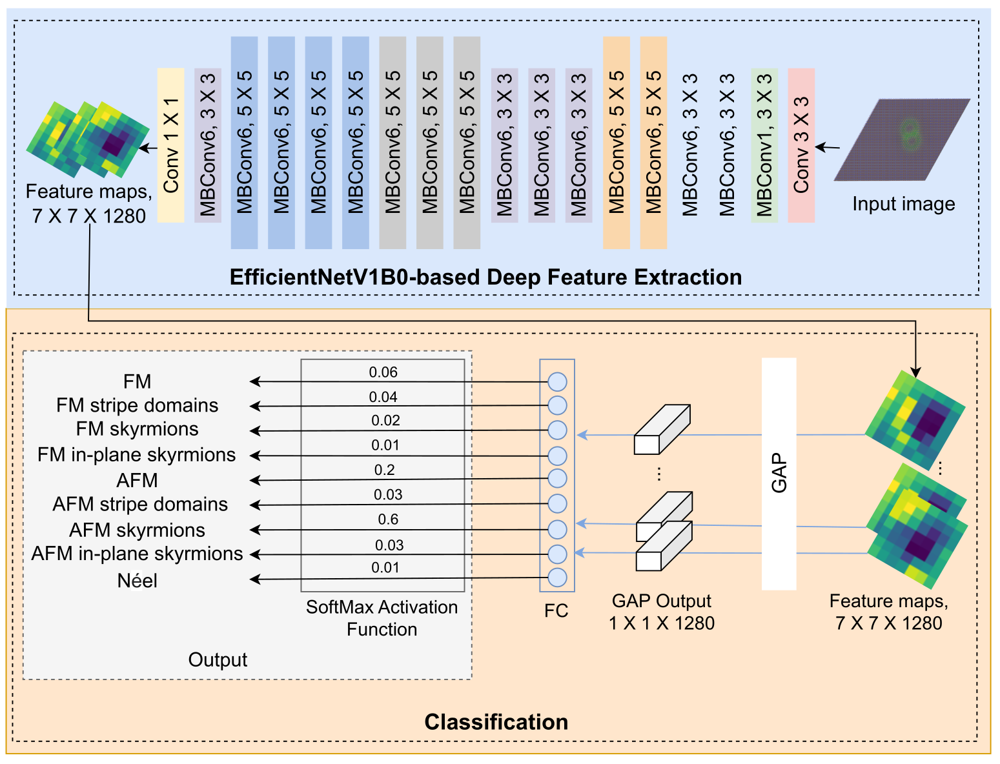

[](https://keras.io/)  [](#) [](https://arxiv.org/abs/XXXX.XXXXX)

## <span style="color:#0B3D91">CNN-MagSpin: CNN-Based Classifier for Automated Identification of Magnetic States in Spin Dynamics Simulations</span>

This repository is for the preprint, available: 

> **CNN-MagSpin: CNN-Based Classifier for Automated Identification of Magnetic States in Spin Dynamics Simulations**  
> Authors: Amal Aldarawsheh, Ahmed Alia, and Stefan Blugel (2025)  
> Preprint: [arXiv:XXXX.XXXXX](https://arxiv.org/abs/XXXX.XXXXX) / DOI: https://doi.org/xxx

### Contents
1. [Abstract](#abstract)
2. [Architecture of the Proposed Classification Model](#architecture-of-the-Proposed-Classification-Model)
3. [Code and Usage](#code-and-usage)
   - Loading and preprocessing the dataset
   - Building nine CNN architectures:
     - EfficientNetB0  
     - MobileNet  
     - MobileNetV2  
     - MobileNetV3Small  
     - DenseNet121  
     - ResNet50  
     - Xception  
     - InceptionResNetV2  
     - ResNet101
5. [Labeled Dataset](#labeled-dataset)
   - Training set  
   - Validation set  
   - Test set
6. [Trained Models](#trained-models)
7. [Citataion](#citation)

### Abstract
The identification and classification of different magnetic states are essential for understanding the complex behavior of magnetic systems. Traditional approaches that rely on handcrafted features or manual inspection often fall short, particularly when dealing with subtle or topologically complex spin textures. 

In this study, we present an automated deep learning model that employs an EfficientNetV1B0 convolutional neural network to classify nine distinct magnetic states, including both ferromagnetic (FM) and—**for the first time**—antiferromagnetic (AFM) spin textures such as AFM skyrmions and AFM stripe domains. The spin configurations are generated through atomistic spin dynamics simulations using the *Spirit* code, then visualized with *VFRendering* to produce RGB images that serve as inputs to the classifier. 

To train and evaluate the model, we created a new dataset of manually labeled RGB images. Experimental results show that the proposed model achieves both accuracy and F1-score of **99%**, significantly outperforming established deep-learning baselines.

### Architecture of the Proposed Classification Model
 As shown in the figure, the proposed model employs an **EfficientNetV1B0-based CNN** to extract discriminative features from magnetic-state images. The feature extractor is followed by a **Dense(9)** layer with **Softmax** activation, producing class probabilities for the **nine** magnetic-state classes.
 
 
### Code and Usage
All code is written in one notebook that covers the complete workflow for magnetic-state image classification:

- **Data loading and preprocessing**
- **Model construction and compilation** for nine CNN architectures:
  - EfficientNetB0  
  - MobileNet  
  - MobileNetV2  
  - MobileNetV3Small  
  - DenseNet121  
  - ResNet50  
  - Xception  
  - InceptionResNetV2  
  - ResNet101
- **Model summaries** for each architecture
- **Training** all architectures and **saving**:
  - Trained models
  - Full training history
- **Evaluation** of trained models using multiple metrics, including the **classification report** and **confusion matrix**

The notebook is designed for ease of use—no advanced programming experience required. 

1. Simply clone the **CNN-MagSpin**  repository
```
git clone https://github.com/Amalaldarawsheh/CNN-MagSpin.git
```
2. [Open the notebook](https://github.com/Amalaldarawsheh/CNN-MagSpin/blob/master/Notebook.ipynb).
3. Run the cells in order. Each cell includes brief guidance describing the required inputs.

### Labeled Dataset
This work created a [labeled dataset](https://github.com/Amalaldarawsheh/CNN-MagSpin/tree/master/Dataset) from scratch to train and evaluate the adapted **EfficientNetV1B0** model and all other baselines. Magnetic states were first generated and visualized as RGB images; these images constitute the samples of the dataset and were then **manually labeled** into **nine classes**.

**Split summary (total: 6,503 images):**
- **Training:** 4,532 images  
- **Validation:** 1,036 images  
- **Test:** 935 images

### Trained Models
The trained models produced in this work are available at this [link](https://github.com/Amalaldarawsheh/CNN-MagSpin/tree/master/trainedModels).

### Citation
``` 
Soon 
```


 

